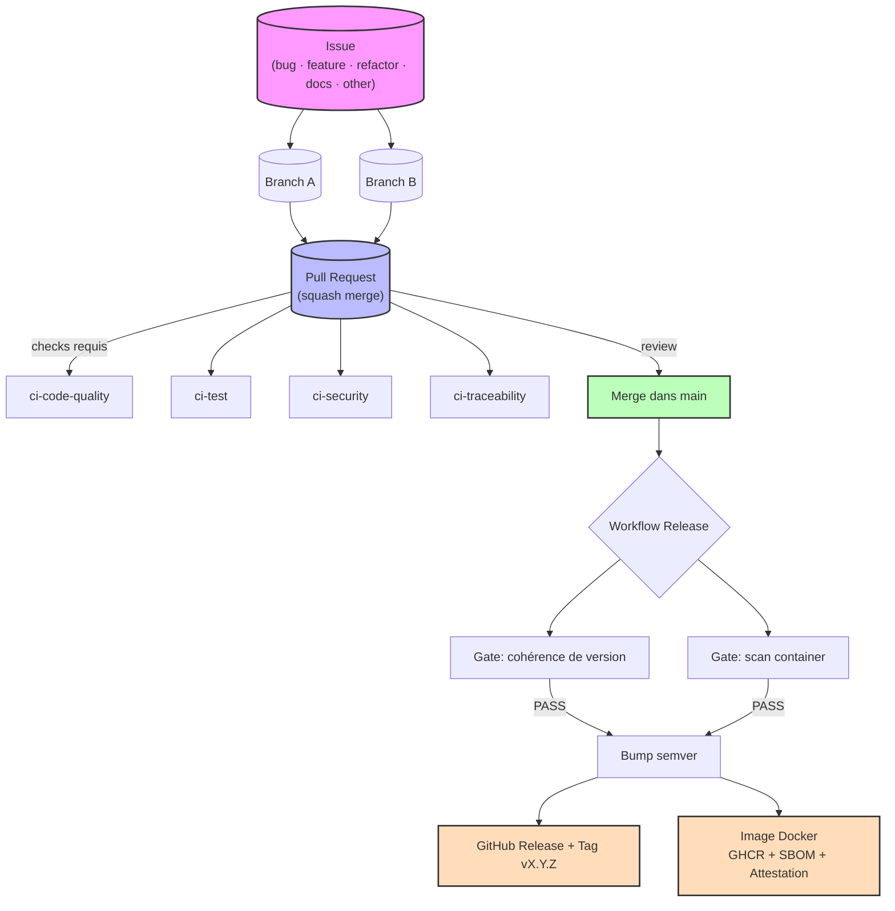

# P5 — Déployez un modèle de Machine Learning

Cette mission suit un scénario de projet professionnel. Déployer un modèle de machine learning à l'aide d'outils modernes.

## 📊 Flux de travail



## 🏗️ Stack technique

| Composant | Technologie |
|-----------|-------------|
| Runtime | Python 3.12+ |
| Framework | FastAPI |
| Gestionnaire de paquets | uv |
| Linter / Formateur | ruff |
| Tests | pytest + coverage |
| Container | Docker |
| Scan de sécurité | Trivy, CodeQL, Gitleaks |
| CI/CD | GitHub Actions |

## 🚀 Démarrage rapide

```bash
# Cloner le dépôt
git clone https://github.com/<org>/P5_Deployez_un_modele_de_Machine_Learning.git
cd P5_Deployez_un_modele_de_Machine_Learning

# Installer les dépendances
uv sync

# Lancer l'application
uv run fastapi dev app/main.py

# Exécuter les tests
uv run pytest --cov=app

# Linter
uv run ruff check .

# Formatter
uv run ruff format .
```

## 📁 Structure du dépôt

```
.github/
├── dependabot.yml           # Mise à jour automatique des dépendances
├── ISSUE_TEMPLATE/           # Templates d'issues (5 types + config)
├── PULL_REQUEST_TEMPLATE.md  # Template de PR
├── rulesets/                 # Rulesets GitHub (branches + tags)
├── security-exceptions.yml  # Exceptions de sécurité
└── workflows/                # Workflows CI/CD
    ├── apply-rulesets.yml      # Application des rulesets
    ├── ci-code-quality.yml     # Qualité du code
    ├── ci-security.yml         # Sécurité (SCA, SAST, secrets, IaC)
    ├── ci-test.yml             # Tests unitaires + couverture
    ├── ci-traceability.yml     # Traçabilité issues/PR
    └── release.yml             # Release (CD)
app/                           # Code source de l'application
CONTRIBUTING.md                # Guide de contribution
RELEASE.md                     # Runbook de release
docs/policies/
├── semver.md                  # Politique de versionnement
└── security-gates.md          # Politique de sécurité
```

## 📚 Documentation

- [Guide de contribution](CONTRIBUTING.md)
- [Runbook Release](RELEASE.md)
- [Politique semver](docs/policies/semver.md)
- [Politique sécurité](docs/policies/security-gates.md)

## 🔒 Sécurité

- Analyse SAST (CodeQL) sur chaque PR
- Scan des dépendances (Trivy + Dependency Review)
- Détection de secrets (Gitleaks)
- Scan des containers avant publication
- Protection des branches (push direct interdit)
- Protection des tags (immuables)

## 📦 Release

Les releases sont automatisées :
1. Merge dans `main` → déclenchement du workflow `release`
2. Calcul de version (Semver automatique)
3. Gates CD (cohérence de version + scan container)
4. Création GitHub Release + tag `vX.Y.Z`
5. Publication image Docker sur GHCR

## 📄 Licence

MIT
