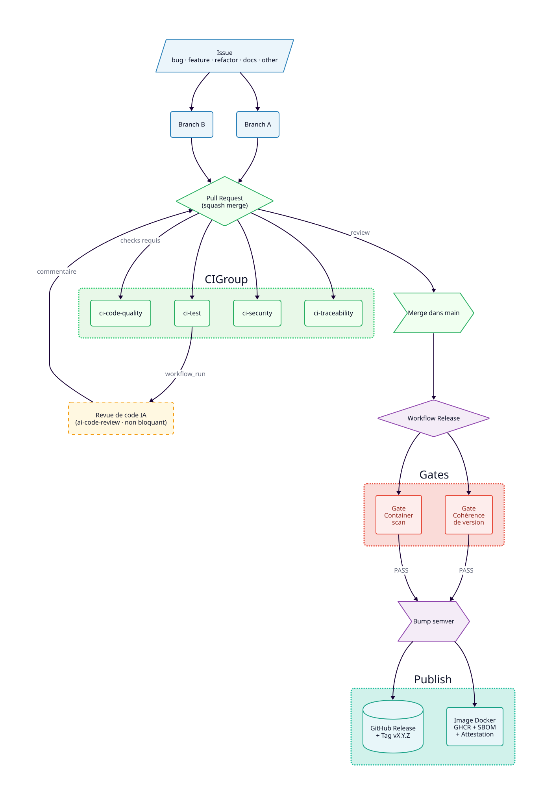
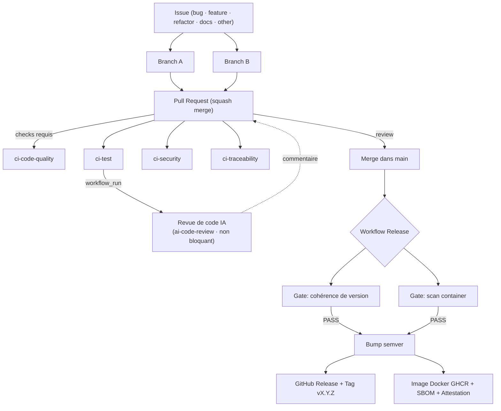

# Pipeline CI/CD

## 📊 Diagramme du flux de travail

<picture>
  <source media="(prefers-color-scheme: dark)" srcset="../diagrams/workflow.svg">
  
</picture>

> Diagramme généré avec [D2](https://d2lang.com/) — source : [`docs/diagrams/workflow.d2`](../diagrams/workflow.d2)

<details>
<summary>Afficher le diagramme Mermaid (fallback)</summary>



</details>

---

## 🔄 Workflows

### CI — Contrôle qualité (PR)

| Workflow | Nom de job (check context) | Responsabilité |
|----------|---------------------------|----------------|
| `ci-code-quality.yml` | `ci-code-quality` | Lint (ruff), format, commitlint, hadolint, actionlint, zizmor, lockfile |
| `ci-test.yml` | `ci-test` | Tests unitaires + couverture, seuil global/incrémental, dry-run, matrices Python 3.11/3.12 |
| `ci-model-performance.yml` | `ci-model-performance` | Gate non-régression du modèle : compare `models/scores.json` (dernier entraînement) à `models/scores_baseline.json` (MedAPE +5 pts / R2 -0,05 par cible) |
| `ci-security.yml` | `ci-security` | SCA (dep-review + trivy fs), SAST (CodeQL), secret leak (Gitleaks), IaC (trivy config), commentaire de synthèse |
| `ci-traceability.yml` | `ci-traceability` | Référence issue obligatoire (R1/R3), type de PR valide, cohérence semver (Q7) |

> Tous les workflows CI sont déclenchés sur `pull_request` vers `main` et partagent la concurrence par PR avec `cancel-in-progress: true`.

### IA — Revue de code & triage (non bloquant)

| Workflow | Déclencheur | Responsabilité |
|----------|-------------|----------------|
| `ai-code-review.yml` | `workflow_run` sur `ci-test` | Poste une revue de code IA sur la PR via l'action [`WillIsback/code-review`](https://github.com/WillIsback/code-review) (runner hébergé, fork-safe, aucun checkout/execution du code de la PR) |
| `ai-issue-triage.yml` | `issues: [opened]` | Triage IA des issues (auteurs de confiance uniquement) |

> Non bloquants (ils ne conditionnent pas le merge). Secrets requis : `VLLM_URL`, `VLLM_API_KEY`, `CF_ACCESS_CLIENT_ID`, `CF_ACCESS_CLIENT_SECRET`.

### CD — Release (post-merge)

```yaml
on:
  push:
    branches: [main]
  workflow_dispatch:
    inputs:
      bump: [auto, patch, minor, major, none]
      dry_run: boolean
```

Sérialisation stricte via `concurrency.group: release-main` (pas de releases en parallèle).

| Job | Rôle |
|-----|------|
| `detect` | Calcule la version semver depuis le dernier tag Git (max des bumps). Seuls `feat`, `fix`, `perf` ou un breaking change déclenchent une release ; sinon `version=skipped` |
| `gate-version-consistency` | Vérifie que le tag n'existe pas, que la version est cohérente |
| `gate-container-scan` | Build l'image Docker, scan Trivy (seuil CRITICAL), vérifie HEALTHCHECK, non-root |
| `publish` | CHANGELOG → GitHub Release → tag `v*` → image Docker GHCR → attestations SBOM |
| `notify-failure` | Commente le merge/PR d'origine si une gate échoue |

---

## 🔒 Sécurité du pipeline

- **Permissions minimales** : chaque workflow et chaque job déclare `permissions:` au plus restrictif.
- **Actions épinglées** : toutes les actions tierces sont référencées par commit SHA (`@<sha>`).
- **Analyse du pipeline** : `actionlint` + `zizmor` dans `ci-code-quality.yml`.
- **Secrets** : le `GITHUB_TOKEN` est utilisé avec les permissions minimales nécessaires.
- **Scan container avant publication** : gate bloquante `gate-container-scan`.

---

## 📚 Documentation associée

- [Guide de contribution](../../CONTRIBUTING.md) — cycle Issue → Branche → PR
- [Runbook de release](../../RELEASE.md) — semver, gates CD, rollback, incidents
- [Politique de version sémantique](../policies/semver.md)
- [Politique des gates de sécurité](../policies/security-gates.md)
- [Action de revue de code IA `code-review`](https://github.com/WillIsback/code-review) — revue de PR + triage d'issues
- [Source D2 du diagramme](../diagrams/workflow.d2)

---

## 🛠️ Génération du diagramme

```bash
# Installer D2 (macOS / Linux)
brew install d2

# Régénérer le SVG
d2 docs/diagrams/workflow.d2 docs/diagrams/workflow.svg --theme 6 --layout dagre --dark-theme 5
```