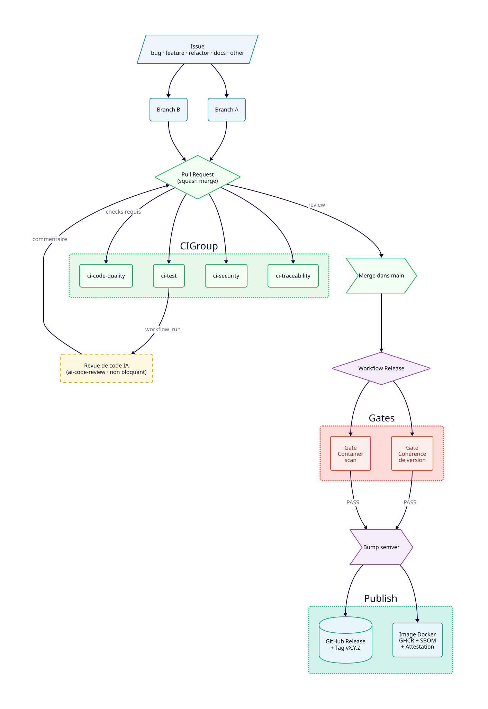
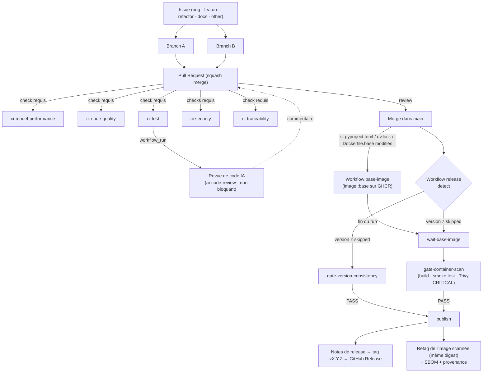

# Pipeline CI/CD

## 📊 Diagramme du flux de travail

<picture>
  <source media="(prefers-color-scheme: dark)" srcset="../diagrams/workflow.svg">
  
</picture>

> Diagramme généré avec [D2](https://d2lang.com/) — source : [`docs/diagrams/workflow.d2`](../diagrams/workflow.d2)
>
> ⚠️ Le diagramme D2/SVG est obsolète : il ne représente ni `ci-model-performance`, ni le workflow `base-image`, ni le smoke test de `gate-container-scan`. Le diagramme Mermaid ci-dessous fait foi en attendant sa régénération.

<details>
<summary>Afficher le diagramme Mermaid (fallback)</summary>


```mermaid
graph TD
    Issue["Issue (bug · feature · refactor · docs · other)"] --> BranchA["Branch A"]
    Issue --> BranchB["Branch B"]
    BranchA --> PR["Pull Request (squash merge)"]
    BranchB --> PR
    PR -->|check requis| CI5[ci-model-performance]
    PR -->|check requis| CI1[ci-code-quality]
    PR -->|check requis| CI2[ci-test]
    PR -->|checks requis| CI3[ci-security]
    PR -->|check requis| CI4[ci-traceability]
    CI2 -->|workflow_run| AI["Revue de code IA<br/>(ai-code-review · non bloquant)"]
    AI -.->|commentaire| PR
    PR -->|review| Merge["Merge dans main"]
    Merge -->|"si pyproject.toml / uv.lock / Dockerfile.base modifiés"| Base["Workflow base-image<br/>(image :base sur GHCR)"]
    Merge --> Detect{"Workflow release<br/>detect"}
    Base -->|"fin du run"| Wait["wait-base-image"]
    Detect -->|"version ≠ skipped"| G1["gate-version-consistency"]
    Detect -->|"version ≠ skipped"| Wait
    Wait --> G2["gate-container-scan<br/>(build · smoke test · Trivy CRITICAL)"]
    G1 -->|PASS| Publish["publish"]
    G2 -->|PASS| Publish
    Publish --> Release["Notes de release → tag vX.Y.Z → GitHub Release"]
    Publish --> Docker["Retag de l'image scannée (même digest)<br/>+ SBOM + provenance"]
```

</details>

---

## 🔄 Workflows

### CI — Contrôle qualité (PR)

| Workflow | Nom de job (check context) | Responsabilité |
|----------|---------------------------|----------------|
| `ci-code-quality.yml` | `ci-code-quality` | Lint (ruff), format, validation du titre de PR (regex Conventional Commits, pas commitlint), hadolint, actionlint, zizmor (voir ci-dessous), lockfile |
| `ci-test.yml` | `ci-test` | Tests unitaires + couverture (service PostgreSQL), seuil global 70 % (bloquant), seuil incrémental 80 % (non bloquant), dry-run applicatif, matrice Python 3.12/3.13 |
| `ci-model-performance.yml` | `ci-model-performance` | Gate non-régression du modèle : compare `models/scores.json` (dernier entraînement) à `models/scores_baseline.json` (MedAPE +5 pts / R2 -0,05 par cible) |
| `ci-security.yml` | `SCA (Dependency Review)`, `SAST (CodeQL)`, `Secret Leak (Gitleaks)`, `IaC / Dockerfile Scan (Trivy config)`, `Synthèse de sécurité` (pas de job `ci-security`) | SCA (dep-review + trivy fs), SAST (CodeQL), secret leak (Gitleaks), IaC (trivy config), commentaire de synthèse |
| `ci-traceability.yml` | `ci-traceability` | Référence issue obligatoire (R1/R3), type de PR valide, cohérence semver (Q7) |

> Tous les workflows CI sont déclenchés sur `pull_request` vers `main` (et `workflow_dispatch`), avec une concurrence par ref et `cancel-in-progress: true`.
>
> **Checks requis** : le ruleset « Protection de main » exige `ci-code-quality`, `ci-test (3.12)`, `ci-test (3.13)`, `ci-traceability`, `ci-model-performance`, `SCA (Dependency Review)`, `SAST (CodeQL)`, `Secret Leak (Gitleaks)`, `IaC / Dockerfile Scan (Trivy config)` (émis par GitHub Actions) et `SonarCloud Code Analysis` (application SonarQube Cloud). Chaque contexte est lié à l'application qui l'émet (`integration_id`), ce qui empêche un autre acteur de le signaler. Le ruleset impose aussi le merge **squash** uniquement et une règle `code_scanning` CodeQL (alertes `errors` et sécurité `high_or_higher`). Renommer un job ou une entrée de matrice impose de mettre à jour le ruleset, sinon les PR restent bloquées en attente du check.

**Précisions sur l'existant** :

- **Titre de PR** : l'étape « commitlint » est une simple regex sur le titre de la PR : `^(feat|fix|refactor|docs|test|chore|perf|ci|build|revert)(\(.+\))?!?: .+`. Le type `style` n'y figure pas.
- **zizmor** : l'étape exécute réellement `uvx zizmor@1.31.0 --min-severity high` sur `.github/workflows/`, uploade le SARIF et échoue sur toute trouvaille de sévérité « high ». Les `dangerous-triggers` justifiés (`workflow_run` de `ai-code-review.yml`) sont neutralisés dans `.github/zizmor.yml`.
- **Couverture incrémentale** : `diff-cover --fail-under=80 … || true` → le résultat est affiché mais n'échoue jamais.
- **Dry-run release** (`ci-test`) : simulé — le script Python affiche un dernier tag codé en dur (`v0.0.1`) et ne lit ni les tags ni les commits. Seul le « dry-run applicatif » (import de `app.main`) teste réellement quelque chose.
- **PostgreSQL** : `ci-test` démarre un service `postgres:17-alpine` et définit `REQUIRE_TEST_DB=1` : si la base est injoignable, les tests BDD échouent au lieu d'être ignorés.
- **Matrice Python** : `ci-test` tourne sur 3.12 (borne minimale de `requires-python`) et 3.13.

### IA — Revue de code & triage (non bloquant)

| Workflow | Déclencheur | Responsabilité |
|----------|-------------|----------------|
| `ai-code-review.yml` | `workflow_run` sur `ci-test` | Poste une revue de code IA sur la PR via l'action [`WillIsback/code-review`](https://github.com/WillIsback/code-review) (runner hébergé, fork-safe, aucun checkout/execution du code de la PR) |
| `ai-issue-triage.yml` | `issues: [opened]` | Triage IA des issues (auteurs de confiance uniquement) |

> Non bloquants (ils ne conditionnent pas le merge). Secrets requis : `VLLM_URL`, `VLLM_API_KEY`, `CF_ACCESS_CLIENT_ID`, `CF_ACCESS_CLIENT_SECRET`.

### CD — Release (post-merge)

```yaml
on:
  push:
    branches: [main]
  workflow_dispatch:
    inputs:
      bump: [auto, patch, minor, major, none]
      dry_run: boolean
```

Sérialisation stricte via `concurrency.group: release-main` (pas de releases en parallèle).

| Job | Rôle |
|-----|------|
| `detect` | Calcule la version semver depuis le dernier tag Git (max des bumps). Seuls `feat`, `fix`, `perf` ou un breaking change `type!:` déclenchent une release ; sinon `version=skipped`. Un commit HEAD dont le sujet contient `[skip release]` court-circuite tout |
| `wait-base-image` | Si le push a modifié les dépendances (`pyproject.toml`, `uv.lock`, `Dockerfile.base`), attend la fin du run `base-image` du même commit avant de construire l'image applicative |
| `gate-version-consistency` | Vérifie que le tag n'existe pas (local et distant) et que la version avance ; écart avec `pyproject.toml` seulement signalé |
| `gate-container-scan` | Build l'image Docker **une seule fois** (poussée en `<version>-candidate` hors dry-run), **smoke test** (import de `psycopg`, `sqlalchemy`, `alembic`, `app.main` dans l'image), scan Trivy (seuil CRITICAL, bloquant) ; HEALTHCHECK, utilisateur et taille seulement affichés (non bloquants) |
| `publish` | CHANGELOG (notes) → tag `vX.Y.Z` → GitHub Release → retag de l'image scannée en `vX.Y.Z`/`vX.Y`/`latest` (`docker buildx imagetools create`, **même digest**) → `attest-build-provenance` |
| `notify-failure` | Si un job échoue sur un `push` : poste un commentaire récapitulatif sur la PR associée au commit, ou à défaut sur le commit |

> L'input `dry_run` (`true` par défaut) exécute `detect` et les gates mais **ne publie rien** (ni tag, ni release, ni image) ; seul un dispatch avec `dry_run: false` publie (voir [RELEASE.md](../../RELEASE.md)).

### Image de base — `base-image.yml`

| Élément | Comportement réel |
|---------|------------------|
| Déclencheurs | `push` sur `main` modifiant `pyproject.toml`, `uv.lock` ou `Dockerfile.base` ; `workflow_dispatch` |
| Produit | `ghcr.io/<owner>/<repo>:base` (dépendances précompilées), consommée par le `Dockerfile` applicatif (`ARG BASE_IMAGE=…:base`) |
| Concurrence | `base-image-main`, `cancel-in-progress: true` |

**Course base-image / release au merge (résolue)** : `base-image.yml` et `release.yml` démarrent en parallèle sur le même push. Le job `wait-base-image` de `release.yml` détecte le run `base-image` du même commit et **attend sa fin** : `gate-container-scan` construit donc toujours à partir d'une `:base` à jour. Le smoke test reste un filet de sécurité.


---

## 🔒 Sécurité du pipeline

- **Permissions** : chaque workflow déclare `permissions:` au niveau workflow (lecture par défaut). Les jobs de `ci-code-quality.yml` (upload SARIF zizmor), de `ci-security.yml`, et les jobs `wait-base-image`, `gate-container-scan`, `publish` et `notify-failure` de `release.yml` redéfinissent leurs permissions ; les autres jobs héritent du niveau workflow.
- **Épinglage** — toutes les actions sont épinglées par SHA (`actions/*`, `github/codeql-action/*`, `docker/*`, `astral-sh/setup-uv`, `hadolint/hadolint-action`, `WillIsback/code-review`) et tous les outils par version : uv `0.13.1`, trivy `v0.76.0` (script et binaire du même tag), actionlint `1.7.12`, gitleaks `v8.30.1`, zizmor `1.31.0`.
- **Analyse du pipeline** : `actionlint` (bloquant) et `zizmor` (bloquant à partir de la sévérité « high ») dans `ci-code-quality.yml`.
- **Secrets** : le `GITHUB_TOKEN` est utilisé avec les permissions minimales nécessaires.
- **Scan container avant publication** : gate bloquante `gate-container-scan`.

---

## 📚 Documentation associée

- [Guide de contribution](../../CONTRIBUTING.md) — cycle Issue → Branche → PR
- [Runbook de release](../../RELEASE.md) — semver, gates CD, rollback, incidents
- [Politique de version sémantique](../policies/semver.md)
- [Politique des gates de sécurité](../policies/security-gates.md)
- [Action de revue de code IA `code-review`](https://github.com/WillIsback/code-review) — revue de PR + triage d'issues
- [Source D2 du diagramme](../diagrams/workflow.d2)

---

## 🛠️ Génération du diagramme

```bash
# Installer D2 (macOS / Linux)
brew install d2

# Régénérer le SVG
d2 docs/diagrams/workflow.d2 docs/diagrams/workflow.svg --theme 6 --layout dagre --dark-theme 5
```